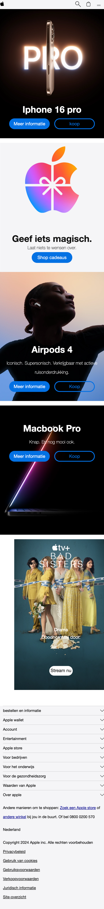
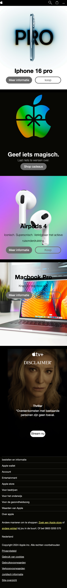

# Procesverslag
Markdown is een simpele manier om HTML te schrijven.  
Markdown cheat cheet: [Hulp bij het schrijven van Markdown](https://github.com/adam-p/markdown-here/wiki/Markdown-Cheatsheet).

Nb. De standaardstructuur en de spartaanse opmaak van de README.md zijn helemaal prima. Het gaat om de inhoud van je procesverslag. Besteedt de tijd voor pracht en praal aan je website.

Nb. Door *open* toe te voegen aan een *details* element kun je deze standaard open zetten. Fijn om dat steeds voor de relevante stuk(ken) te doen.

## Jij

  
uitwerken voor kick-off werkgroep

  ### Auteur:
  Luna Heeremans

  #### Je startniveau:
  Rood

  #### Je focus:
  surface plane
 

## Je website

  
uitwerken voor kick-off werkgroep

  ### Je opdracht:
 (https://www.apple.com)

  #### Screenshot(s) van de eerste pagina (small screen): 
  home apple 
<<<<<<< HEAD
  

  #### Screenshot(s) van de tweede pagina (small screen):
  support apple
  
 

## Toegankelijkheidstest 1/2 (week 1)

  
uitwerken na test in 2e werkgroep

  ### Bevindingen
  Lijst met je bevindingen die in de test naar voren kwamen:
<ol> <li>Voice leest alles netjes en duidelijk voor, zonder enige foutjes.</li>
  <li>Alt tekst gaat wel veel fout, vooral bij symbolen</li>
  <li>Grote teksten worden voorgelezen, maar het is wel lastig omdat die qua spelling voorleest.</li>
  <li>Alle grote foto's hebben wel een goede alt.</li>
  <li>De website heeft geen functie van dark-mode.</li>
  <li>Tijdens het testen springt de voice-over van teksten voorlezen naar per letter voorlezen.</li>
  <li>Bij lijstjes leest die netjes van boven naar beneden, maar kan ook van links naar rechts</li>
  <li>Wat wel vervelend is, is dat hij blijft vasthangen op voetnoten</ul>
  <li>Bij de apple + film stukje, leest die het voor en heeft die juiste alt tekst. </li>
  <li>Het laat weten hoeveel onderdelen er per onderwerp of onderdeel staat.</li>
</ol>

## Breakdownschets (week 1)

  
uitwerken na afloop 3e werkgroep

  ### de hele pagina: 
  

  ### dynamisch deel (bijv menu): 
  

  ### wellicht nog een dynamisch deel (bijv filter): 
  

  ### dynamisch deel (bijv menu): 
  

   ### dynamisch deel (bijv menu): 
  

   ### dynamisch deel (bijv menu): 
  

  ### wellicht nog een dynamisch deel (bijv filter): 
  

## Voortgang 1 (week 2)

  
uitwerken voor 1e voortgang

  ### Stand van zaken
  hier dit ging goed & dit was lastig (neem ook screenshots op van delen van je website en code)
 

  ### Agenda voor meeting
  samen met je groepje opstellen

  | Joost       | Luna                   | iris      
  | tekst en foto's over elkaar            | Align items of justify | hetzelfde als joost       
  | pixels      | goed iets oproepen     | hetzelfde als luna    
  | svg images  | :nth child of h2 t {   |  binnen een grid afbeeldingen centreren
  |           |                

  ### Verslag van meeting
  hier na afloop snel de uitkomsten van de meeting vastleggen

  - mijn html staat goed. 
  - we hebben de z-index aangepast zodat het menu boven alles komt.
  - we hadden niet zoveel tijd om op mijn dingetjes in te gaan. dus we hebben even gekeken naar mijn html, hier stond nog wat styling in, maar dit was om even te kijken. dus die moet weg.

## Voortgang 2 (week 3)

  
uitwerken voor 2e voortgang

  ### Stand van zaken
  hier dit ging goed & dit was lastig (neem ook screenshots op van delen van je website en code)
 

  ### Agenda voor meeting
  samen met je groepje opstellen

  | Alycia    | Iris  | Luna   |
  | dropdown  | dropdown |grid        | 
  | navigatie  | kleurverandering| animatie    | 
  | flexbox en grid | - | responsive | 
  

  ### Verslag van meeting
  hier na afloop snel de uitkomsten van de meeting vastleggen

  - ik snap grid eindelijk
  - black en white nog doorgenomen
  - we hadden nu bij sanne feedback en hier heeft hij me geholpen met de grid, ik begreep dit niet helemaal dus hij heeft me hiermee kunnen helpen. ook heb ik mijn dark/light laten zien en hierop had ik feedback gekregen dat sommige toch wel echt een andere image moet krijgen.

## Toegankelijkheidstest 2/2 (week 4)

  
uitwerken na test in 9e werkgroep

  ### Bevindingen
  Lijst met je bevindingen die in de test naar voren kwamen (geef ook aan wat er verbeterd is):
  <ol> <li>hij leest mijn gehele menu inhoud voor zonder het openen van het menu.</li>
  <li>leest mooi duidelijk voor en tab werkt.</li>
  </ol>
  
  dingen dat ik nu wel heb en de apple site niet:
  <ol>
  <li>mijn code is goedgekeurd en helemaal netjes van Validater</li>
  <li>ensure space between interactive area's. ik heb daar ruimtes tussen gehouden</li>
  <li>heading elements logical sequence, ik heb me netjes aan volgorde gehouden</li>
  <li>don't skip heding levels: apple heeft h1 op display none, dit is niet leesbaarvoor de screenreader dus ik heb het op a11y manier</li>
  <li>al mijn images hebben een alt beschrijving</li>
  <li>images containing text is een alt, ik heb voor alles een alt</ul>
  <li>mijn video heeft geen autoplay </li>
  <li>ik heb controls met :focus</li>
    <li>hij identificeert dat er een nieuwe tab of window komt</li>
    <li>ik heb een dark/light mode</li>
    <li>ik heb media query</li>
    <li>ik heb een dark/light mode</li>
</ol>

dingen dat ik niet heb en waarom niet:
<li>ik heb geen maps, graphics of charts in mijn website dus hierop heb ik een no gegeven</li>
  <li>video: ik heb geen comfirm dat er captions zijn</li>
  <li>audio: ik heb een transcriptie in de video aangezien het een lyrics video is, dit weet de reader alleen niet.</li>
  <li>ik heb geen skip link.</li>
  <li>ik heb geen high contrast mode, wilde ik wel, geen tijd voor gehad</li>

## Voortgang 3 (week 4)

  
uitwerken voor 3e voortgang

  ### Stand van zaken
  

  ### Agenda voor meeting
  samen met je groepje opstellen

  | Joost     | Iris  | Luna  |
  |svg path   | dialog| slideshow| 
  | start/stop muziek| pop up| thema's   
  | fonts | | nog een punt | 
  

  ### Verslag van meeting
  hier na afloop snel de uitkomsten van de meeting vastleggen

  - ik heb besproken hoe ik een slideshow goed kan maken.
  - ik moet een stukje code aan begin van html zetten zodat safari en chrome hetzelfde zijn.
  - dit was mijn laatste bespreking, hier was ik alleen even niet met mijn hoofd bij. ik heb gevraagd voor een voorbeeld van een slide show, en ik moet een stukje code in mijn css stoppen zodat de safari en chome versie hetzelfde zijn.

## Eindgesprek (week 5)

  
uitwerken voor eindgesprek

  ### Je uitkomst - karakteristiek screenshots:
  dit is mijn eerste pagina
  
  dit is mijn tweede pagina
   

  ### Dit ging goed/Heb ik geleerd: 
  Korte omschrijving met plaatjes
  
dark en light modus geleerd
  
Grid geleerd
 
  
  
  ### Dit was lastig/Is niet gelukt:
  Korte omschrijving met plaatjes
het is mij niet gelukt om een slidehow goed te maken, ik vond het heel moeilijk om zoveel elementen te hebben in een section. ik had al moeite met grid en dat erbij vond ik echt te moeilijk en kreeg ik niet voor elkaar, nu gaat het gewoon op tijd. 
  

## Bronnenlijst

  
continu bijhouden terwijl je werkt

  Nb. Wees specifiek ('css-tricks' als bron is bijv. niet specifiek genoeg). 
  Nb. ChatGpT en andere AI horen er ook bij.
  Nb. Vermeld de bronnen ook in je code.

  1. Header nav hamburger samen met sanne in les met behulp van: https://codepen.io/LHeeremans/pen/BaXgvMK?editors=0010
  2. hidden code van a11yproject: gezocht a11y hide content -> https://www.a11yproject.com/posts/how-to-hide-content/
  3. dit heb ik van chatgpt/ prompt: hoe maak ik een slider voor het aanpassen van de letter grootte? https://chatgpt.com
  4. tekst en foto's van https://www.apple.com

